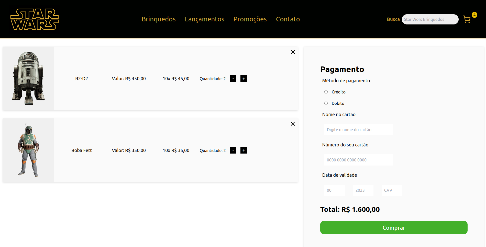

## Índice

- [Link de Acesso](#Link-de-Acesso)
- [Resumo do Projeto](#Resumo-do-projeto)
- [Definição do Produto](#Definição-do-Projeto)
- [Lista de Requisitos](#Lista-de-Requisitos)
- [Instalação](#Instalação)
- [Iniciando](#Iniciando)
- [Tecnologias e Ferramentas Utilizadas](#Tecnologias-e-Ferramentas-Utilizadas)
- [Lista de Requisitos do Projeto](#Lista-de-Requisitos-do-Projeto)
- [Desktop](#Desktop)
- [Mobile](#Mobile)

## Link de Acesso

Link surge: http://anderson-ribeiro.surge.sh/

## Resumo do Projeto

O Labecommerce é um e-commerce com recursos avançados que permite aos usuários ordenar, pesquisar e filtrar produtos de forma intuitiva. Ele também oferece um carrinho de compras completo, com resumo da compra, opção de limpar o carrinho e ajustar as quantidades. Além disso, o Labecommerce possui organização em páginas e a capacidade de ocultar o carrinho para visualizar mais produtos.

- JSX
- Componentes
- Props
- Estado
- Fluxo de dados no React
- Renderização de listas
- Renderização condicional
- localStorage

## Instalação

- Node.js
- npm

Para instalar as dependências no diretório do seu projeto, execute o seguinte comando:

- npm install

## Iniciando

Para iniciar o aplicativo, execute o seguinte comando:

- npm run start

## Tecnologias e Ferramentas Utilizadas

Este site foi construído com as seguintes tecnologias:

- React
- React-Hooks
- React-Router-Dom
- JavaScript
- Styled-Components
 

## Definição do Produto

- O Labecommerce oferece diversas funcionalidades aos usuários:

- Ordenação dos produtos por preço em duas opções:

- Ordem crescente
- Ordem decrescente

- Pesquisa de produtos por nome, considerando letras minúsculas ou maiúsculas.

- Filtragem por valores com dois tipos de filtros:

- Valor mínimo
- Valor máximo

- Todos os filtros podem ser usados simultaneamente.

- No carrinho, é possível ver um resumo da compra, incluindo a quantidade de itens e o valor total.
- O usuário pode limpar o carrinho com um único clique no ícone do "X". Além disso, no carrinho,  
  existem botões que permitem aumentar ou diminuir a quantidade de um item.

- Ao lado do carrinho existe um campo com formulário com validações.

- Os itens do carrinho permanecem no carrinho mesmo após a atualização da página.

- A página é um site responsivo que se adapta a diferentes dispositivos, oferecendo uma experiência
  de visualização otimizada em desktops, tablets e smartphones. Ela foi projetada para fornecer uma interface amigável e agradável aos usuários, independentemente do dispositivo utilizado.

### Lista de Requisitos

- Home (Lista de Produtos)
  - [ ] O usuário deve ser capaz de visualizar uma lista de produtos
  - [ ] O usuário deve ser capaz de visualizar os dados do produto (nome, preço e imagem)
  - [ ] O usuário deve ser capaz de adicionar um produto no carrinho
- Carrinho
  - [ ] O usuário deve ser capaz de visualizar os produtos adicionados
  - [ ] O usuário deve ser capaz de visualizar a quantidade correta de cada produto
  - [ ] O usuário deve ser capaz de remover itens do carrinho
  - [ ] O usuário deve ser capaz de ver corretamente o valor total de sua compra
  - [ ] Quando a página é atualizada, os itens devem continuar no carrinho
- Filtros e Ordenação
  - [ ] O usuário deve ser capaz de filtrar os itens por preço mínimo
  - [ ] O usuário deve ser capaz de filtrar os itens por preço máximo
  - [ ] O usuário deve ser capaz de realizar uma busca por nome
  - [ ] O usuário deve ser capaz de ordenar os itens em ordem crescente ou decrescente
  - [ ] O usuário deve ser capaz de adicionar filtros, busca e ordenação simultaneamente
  - [ ] O usuário deve ser capaz de retornar à visualização sem filtros

## Desktop

## Mobile

## Desenvolvedor

- Projeto desenvolvido por:

<strong>Andrson Ribeiro Nunes</strong>
